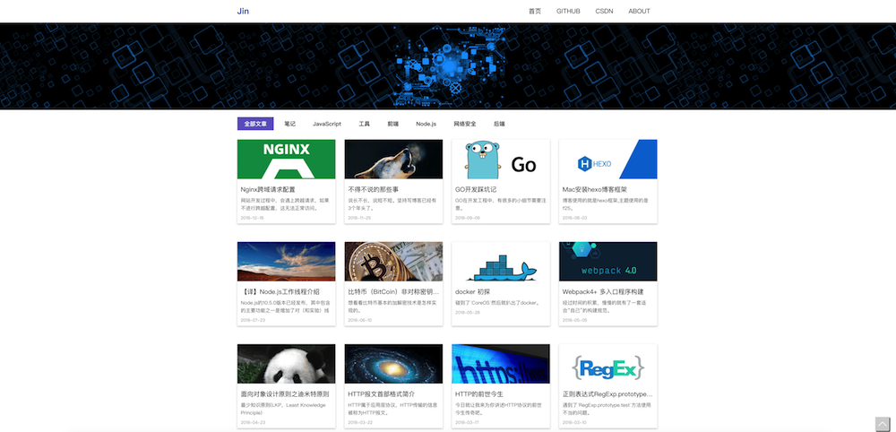

# hexo-theme-f25
this is a blog theme for hexo.





demo : [https:jinyy.app](https://jinyy.app)

demo : [https:futu.im](https://futu.im)


futu.im github: [https://github.com/futuweb/futu.im](https://github.com/futuweb/futu.im)


## npm install

```sh
git clone https://github.com/Yi-love/hexo-theme-f25.git
```

## config 
not next page , only one page.

```yml
# _config.yml
# required

title: 
subtitle:  
description:  
keywords:  
author:  
language: zh-CN
timezone: Asia/Shanghai

copyright:  


# required
menu:
  Home: /
  About: /about

index_generator:
  path: ''
  per_page: 10000

# not next page , only one page.
per_page: 10000

# required
theme: hexo-theme-f25
```

```yml
# themes/hexo-theme-f25/_config.yml
# required

default_cover: images/default_cover.jpg

google_analytics: 
# favicon
favicon: /images/favicon.ico
```


## source/\_posts
source post file.

example:

```md
---
date: 2018-11-20 12:00
title:  this is a title
subtitle: subtitle show you
cover: /images/first_cover.jpg
categories: [Node.js]
---
```

